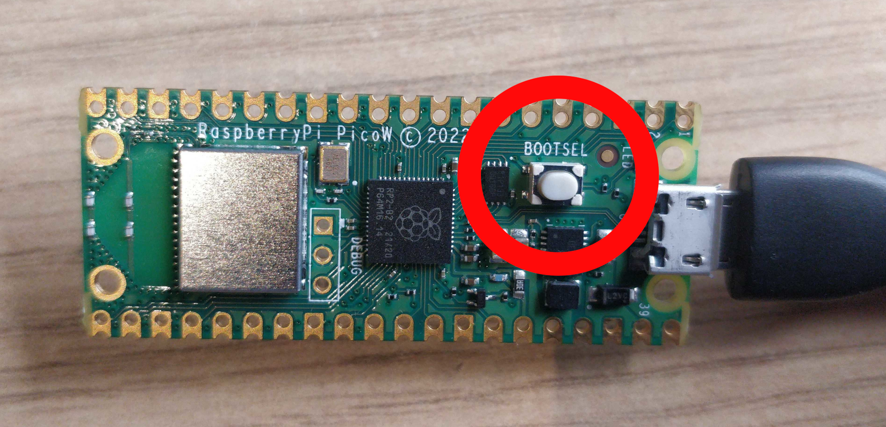

# 🦆 Convierte tu Raspberry Pi Pico W en un Rubber Ducky (BadUSB)

> ⚠️ **Aviso legal**  
Este proyecto tiene fines exclusivamente **educativos** y de **concienciación en ciberseguridad**. No me hago responsable del uso indebido de esta herramienta. El conocimiento es poder, pero también responsabilidad.

---

## 🔧 Pasos para configurar tu BadUSB

### Paso 1: Clona este repositorio

```bash
git clone https://github.com/tuusuario/tu-repo.git
```

---

### Paso 2: Conecta tu Raspberry Pi Pico W en modo BOOTSEL

1. Mantén pulsado el botón **BOOTSEL** de la Raspberry Pi Pico W.
2. Conéctala al puerto USB del ordenador mientras mantienes el botón presionado.
3. La placa aparecerá como una **unidad externa** en tu explorador de archivos.



---

### Paso 3: Formatea la placa

Copia el archivo `format.uf2` a la memoria de la Raspberry Pi. Este archivo se encargará de formatear el chip para evitar errores futuros. Espera a que el dispositivo se reinicie automáticamente.

---

### Paso 4: Instala CircuitPython

Copia el archivo `circuit_python.uf2` a la memoria de la placa y espera nuevamente a que se reinicie.

---

### Paso 5: Añade las librerías necesarias

Dentro del repositorio, entra en la carpeta `/lib` y copia la carpeta `adafruit_hid` dentro del directorio `/lib` de la Raspberry Pi Pico W.

---

### Paso 6: Copia el archivo de control

Copia el archivo [`code.py`](code.py) a la **raíz del dispositivo** (es decir, fuera de cualquier carpeta).

---

### Paso 7: Añade tu payload

Ahora ya puedes usar tu Raspberry Pi Pico W como si fuera un teclado. Para ejecutar un script:

1. Coge un ejemplo de la carpeta `/scripts` del repositorio.
2. Renómbralo a `payload.dd`.
3. Mueve ese archivo a la **raíz del dispositivo**.

> ⚠️ En cuanto el archivo `payload.dd` esté en la raíz, se ejecutará automáticamente al conectar la placa a un ordenador.

---

## ⌨️ Problemas con el idioma del teclado

Por defecto, la Raspberry Pi enviará pulsaciones de teclas como si fuera un teclado con distribución **inglesa (US)**. Esto puede provocar errores si el ordenador víctima usa otra distribución.

### Soluciones posibles:

#### 🅰️ Cambiar el idioma del teclado de la víctima a inglés (US)
La forma más sencilla si tienes acceso físico al equipo.

#### 🅱️ Editar el archivo `code.py`
1. Descomenta las líneas 14 y 15.
2. Cambia `LANG` por el idioma del teclado de la víctima.
3. Comenta las líneas 9 y 10.
4. Asegúrate de que los archivos de idioma estén en `adafruit_hid`.

> ⚠️ *Este método no me ha funcionado personalmente tras múltiples intentos. Si consigues hacerlo funcionar puedes contribuir en el repositorio*

#### 🅾️ Traducir manualmente los caracteres especiales
Este es el método que yo utilizo, a continuación pongo un ejemplo con el teclado español.

- Muchos caracteres no se escriben igual. Por ejemplo, al escribir `"` puede aparecer `[`, y viceversa.
- La solución es crear un **payload de prueba** como diccionario de referencia:

```plaintext
STRING **!** " # $ % & ' ( ) * + , - . / : ; < = > ? @ [ \ ] ^ _ { | } ~
```

- Ejecuta ese payload y observa qué se imprime en la máquina víctima. Así podrás construir tus scripts reemplazando los caracteres problemáticos.

Por ejemplo, para escribir `https://google.com`, deberías escribir en el payload:

```plaintext
STRING https**>&&google+com
```

---

